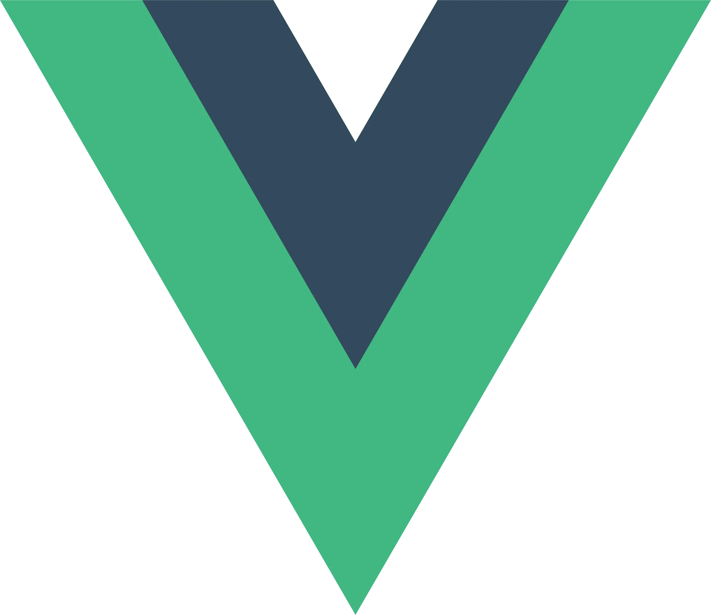
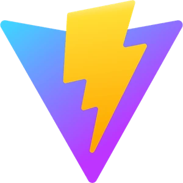
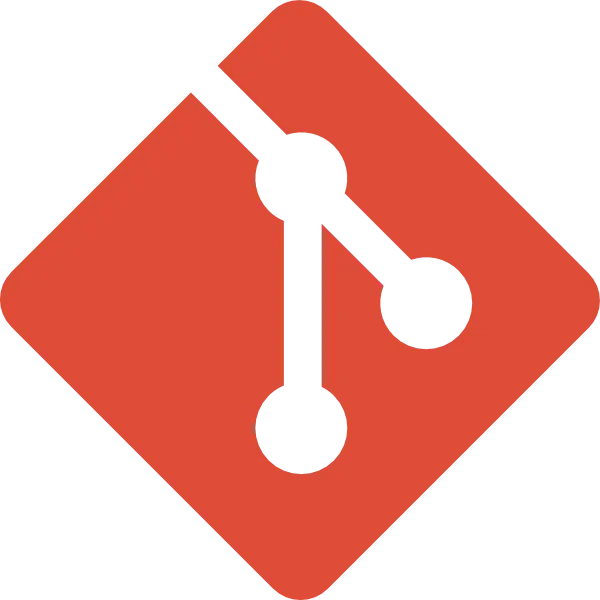
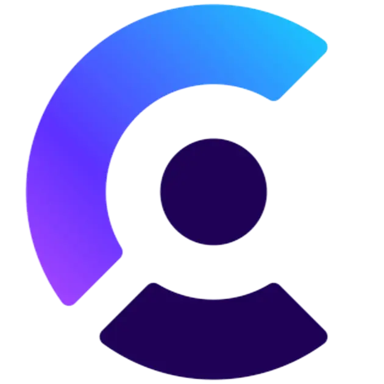
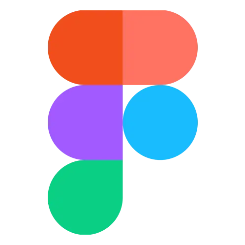

<h1 align="center">Hi 👋, I'm Fandi Ahmad</h1>
<h3 align="center">Full Web Stack Developer</h3>

<!-- Image by catalyststuff on Freepik -->
<!--  -->

A passionate and dedicated Full Stack Web Developer with a strong backgrounf  in frontend and backend development. Some if the projects I create, are created with JavaScript.
- 🌱 I'm focusing on the JavaScript programming language and its supporting frameworks
- 👨‍💻 All of my projects are available at [fandiahmad.vercel.app](https://fandiahmad.vercel.app/)
- 💬 Ask me about **Web Programming**

## 📌 What I Do

- `Web Development`
Website development, suitable for company or indiviual profiles supported by modern technology.

- `Web Based Aplication`
Design and development of website-based applications, such as archive system, data management, sales, and many more.

## 🌐 Socials:

  
  
  

  

## 💻 Tech Stack:

  
  
  
  
  
  
  
  
  
  
  
  
  
  
  
  
  
  
  

# 📊 GitHub Stats:

<!-- 
&nbsp;
 -->

<!--  -->

<!-- Proudly created with GPRM ( https://gprm.itsvg.in ) -->
